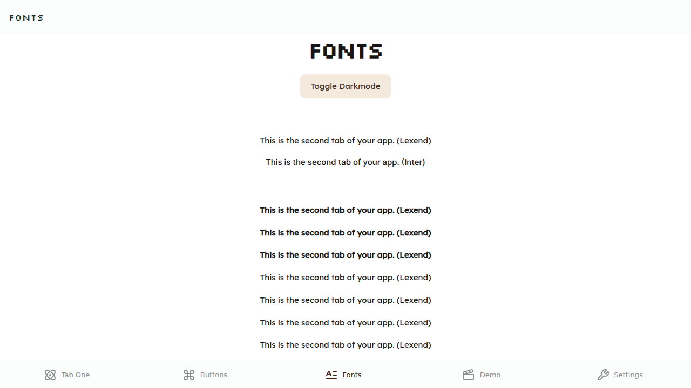
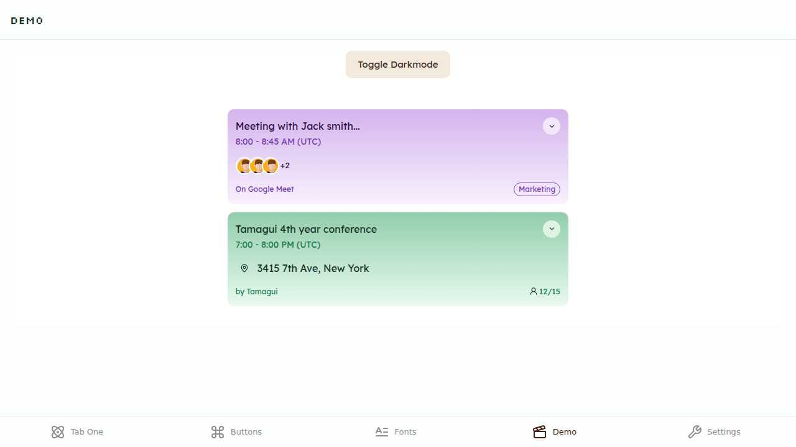
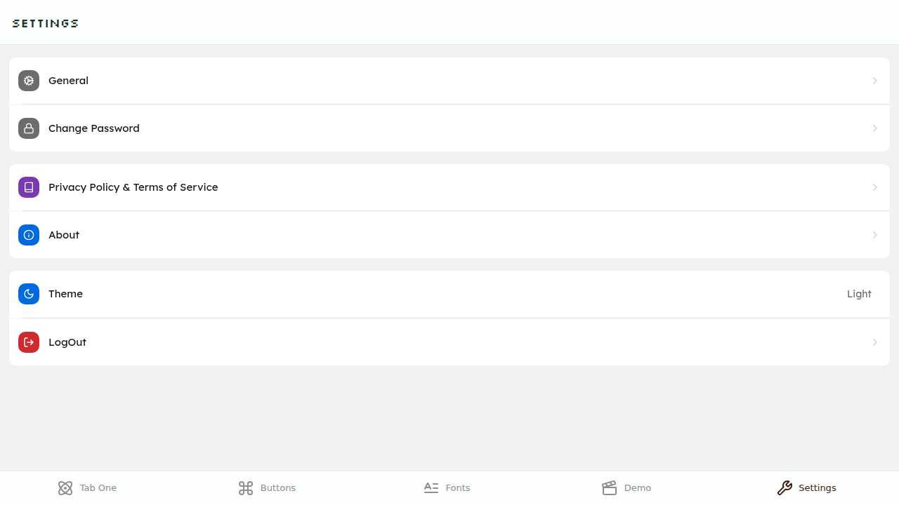
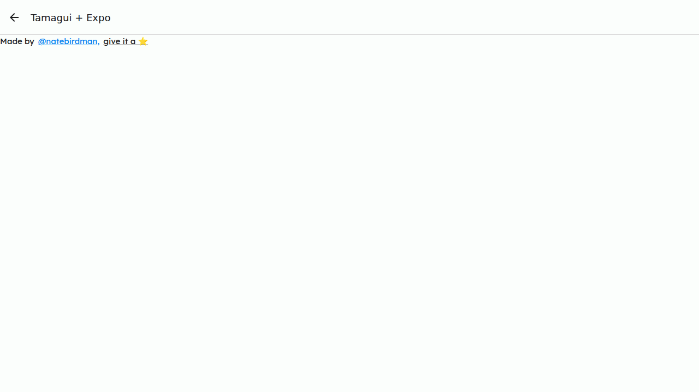

# Expo + Tamagui Demo App

A modern cross-platform mobile application showcasing the powerful combination of **Expo** and **Tamagui** for building beautiful, performant apps that run on iOS, Android, and Web.

## 🚀 Features

- 🎨 **Modern UI Components** - Built with Tamagui's comprehensive design system
- 🔐 **Authentication Flow** - Complete onboarding, sign-in, and sign-up experience  
- 📱 **Cross-Platform** - Runs seamlessly on iOS, Android, and Web
- 🎭 **Multiple Themes** - Light/dark mode support with beautiful color schemes
- 🔤 **Custom Typography** - Multiple font families including Silkscreen and Lexend
- 📊 **Interactive Demos** - Button variations, font samples, and UI components
- 🚦 **Navigation** - Tab-based navigation with Expo Router
- 🎪 **Modal Support** - Smooth modal presentations
- 📱 **Responsive Design** - Adaptive layouts for different screen sizes

## 📸 Screenshots

### Onboarding Experience
Beautiful step-by-step introduction to the app features.


### Authentication Screens

**Sign In**


**Sign Up**  


### Main Application

**Home Screen with Toast Demo**


**Button Component Showcase**


**Typography & Fonts**


**Demo Components**


**Settings Screen**


**Modal Example**


## 🛠️ Tech Stack

- **[Expo SDK 53](https://expo.dev/)** - Universal React applications
- **[Tamagui](https://tamagui.dev/)** - Universal UI system for React Native + Web
- **[Expo Router](https://expo.github.io/router/)** - File-based routing for React Native apps
- **[TypeScript](https://www.typescriptlang.org/)** - Type safety and better development experience
- **[React Native](https://reactnative.dev/)** - Cross-platform mobile development
- **[Yarn Workspaces](https://yarnpkg.com/features/workspaces)** - Monorepo package management

## 📋 Prerequisites

- Node.js 18+ 
- Yarn 4.5.0+
- Expo CLI
- iOS Simulator (for iOS development)
- Android Studio & Emulator (for Android development)

## 🚀 Getting Started

### 1. Clone the repository
```bash
git clone <repository-url>
cd expo-tamagui-demo
```

### 2. Install dependencies
```bash
yarn install
```

### 3. Start the development server
```bash
# Start with cache clearing
yarn start

# Or for specific platforms
yarn web      # Web development
yarn ios      # iOS development  
yarn android  # Android development
```

### 4. Open the app
- **Web**: Open http://localhost:8081 in your browser
- **Mobile**: Scan QR code with Expo Go app or use simulator

## 📁 Project Structure

```
expo-tamagui-demo/
├── app/                    # App screens and navigation
│   ├── (auth)/            # Authentication screens
│   ├── (tabs)/            # Main tabbed interface
│   ├── _layout.tsx        # Root layout component
│   └── modal.tsx          # Modal screen
├── src/                   # Source code
│   └── features/         # Feature-specific components
│       └── auth/         # Authentication features
├── packages/              # Monorepo packages
│   └── ui/               # Custom UI component library
├── screenshots/           # App screenshots
├── assets/               # Images, fonts, and other assets
└── package.json          # Dependencies and scripts
```

## 🎨 Customization

### Themes & Colors
Modify theme configuration in `packages/ui/src/themes/`

### Typography  
Update font configurations in `packages/ui/src/config/fonts.ts`

### Components
Add custom components to `packages/ui/src/`

## 🔧 Development Notes

### Metro Configuration
The app includes specific Metro configuration for proper monorepo support:

```json
"resolutions": {
  "metro": "^0.82.0",
  "metro-config": "^0.82.0", 
  "metro-resolver": "^0.82.0"
}
```

### New Architecture Support
Enabled for both iOS and Android using Expo's new architecture:

```json
"newArchEnabled": true
```

## 🧪 Available Scripts

- `yarn start` - Start Expo development server
- `yarn web` - Start web development server
- `yarn ios` - Run on iOS simulator
- `yarn android` - Run on Android emulator
- `yarn test` - Run Jest tests
- `yarn upgrade:tamagui` - Update all Tamagui packages
- `yarn check:tamagui` - Check Tamagui configuration

## 📚 Learn More

- [Expo Documentation](https://docs.expo.dev/)
- [Tamagui Documentation](https://tamagui.dev/docs/intro/introduction)
- [Expo Router Documentation](https://expo.github.io/router/docs/)
- [React Native Documentation](https://reactnative.dev/docs/getting-started)

## 🤝 Contributing

Contributions are welcome! Please feel free to submit a Pull Request.

## 📄 License

This project is open source and available under the [MIT License](LICENSE).

---

Built with ❤️ using Expo and Tamagui

