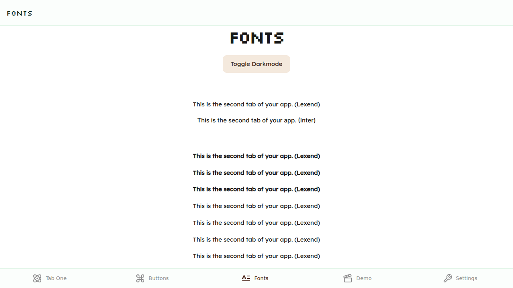
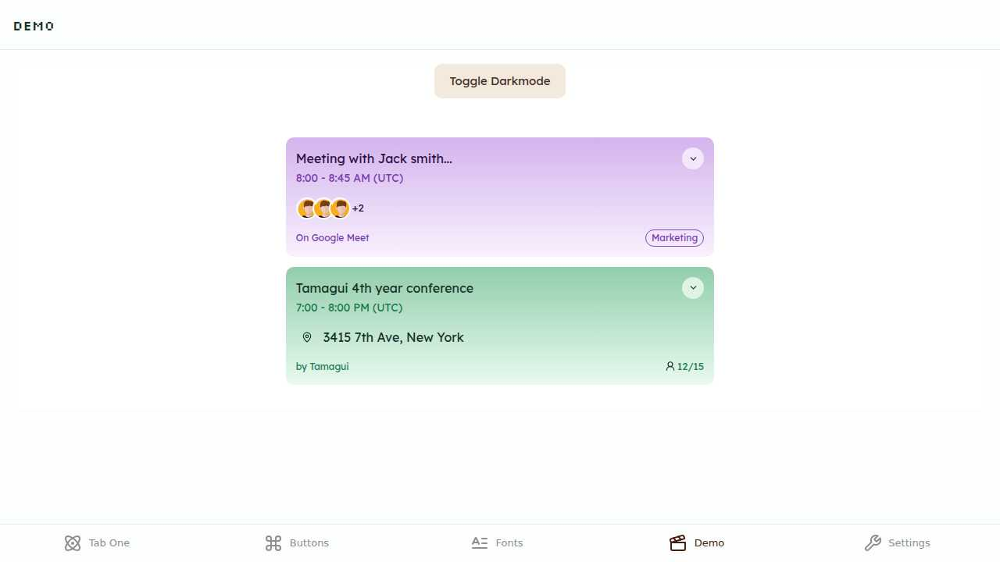
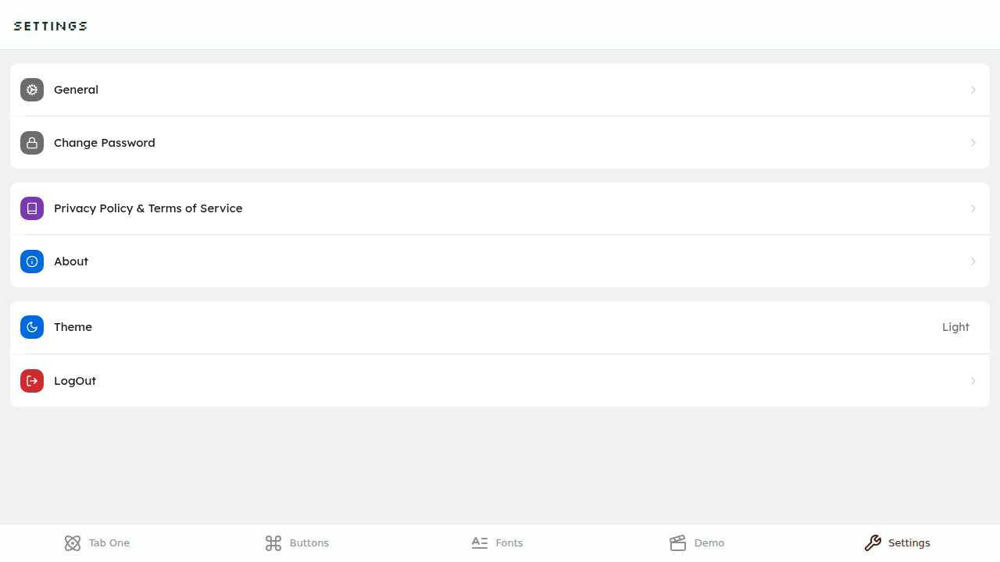
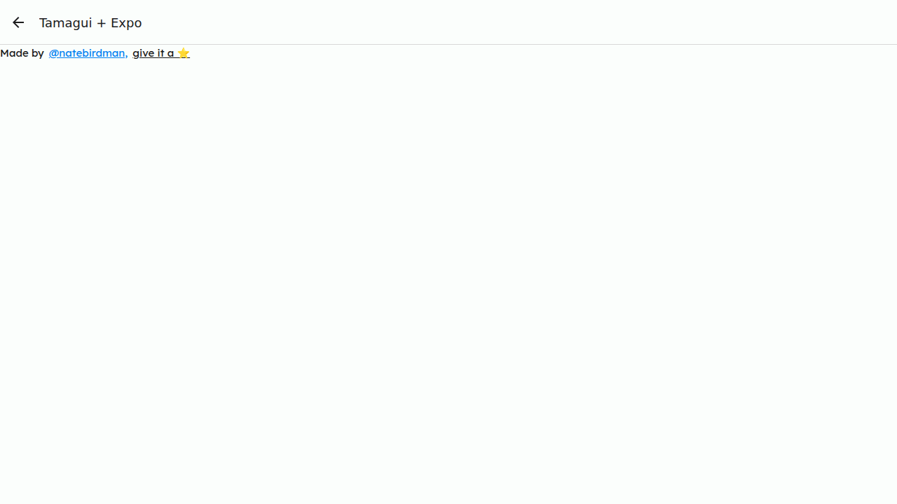

# Expo + Tamagui Demo App

A modern cross-platform mobile application showcasing the powerful combination of **Expo** and **Tamagui** for building beautiful, performant apps that run on iOS, Android, and Web.

This starter-kit has been inspired by tamagui-expo-router-starterkit. 

## 🚀 Features

- 🎨 **Modern UI Components** - Built with Tamagui's comprehensive design system
- 🔐 **Authentication Flow** - Complete onboarding, sign-in, and sign-up experience  
- 📱 **Cross-Platform** - Runs seamlessly on iOS, Android, and Web
- 🎭 **Multiple Themes** - Light/dark mode support with beautiful color schemes
- 🔤 **Custom Typography** - Multiple font families including Silkscreen and Lexend
- 📊 **Interactive Demos** - Button variations, font samples, and UI components
- 🚦 **Navigation** - Tab-based navigation with Expo Router
- 🎪 **Modal Support** - Smooth modal presentations
- 📱 **Responsive Design** - Adaptive layouts for different screen sizes

## 📸 Screenshots

### Onboarding Experience
Beautiful step-by-step introduction to the app features.


### Authentication Screens

**Sign In**


**Sign Up**  


### Main Application

**Home Screen with Toast Demo**


**Button Component Showcase**


**Typography & Fonts**


**Demo Components**


**Settings Screen**


**Modal Example**


## 🛠️ Tech Stack

- **[Expo SDK 53](https://expo.dev/)** - Universal React applications
- **[Tamagui](https://tamagui.dev/)** - Universal UI system for React Native + Web
- **[Expo Router](https://expo.github.io/router/)** - File-based routing for React Native apps
- **[TypeScript](https://www.typescriptlang.org/)** - Type safety and better development experience
- **[React Native](https://reactnative.dev/)** - Cross-platform mobile development
- **[Bun](https://bun.sh/)** - Ultra-fast JavaScript runtime and package manager

## 📋 Prerequisites

- Bun 1.1.38+ (replaces Node.js and Yarn)
- Expo CLI
- iOS Simulator (for iOS development)
- Android Studio & Emulator (for Android development)

## 🚀 Getting Started

### 1. Install Bun

If you don't have Bun installed:
```bash
curl -fsSL https://bun.sh/install | bash
```

Or with npm:
```bash
npm install -g bun
```

### 2. Clone the repository
```bash
git clone <repository-url>
cd expo-tamagui-demo
```

### 3. Install dependencies
```bash
bun install
```

### 4. Start the development server
```bash
# Start with cache clearing
bun start
```

### 5. Open the app
- **Mobile**: Scan QR code with Expo Go app or use simulator

> **Note**: For detailed information about using Bun, see [BUN_MIGRATION.md](./BUN_MIGRATION.md)

## 📁 Project Structure

```
expo-tamagui-demo/
├── app/                    # App screens and navigation
│   ├── (auth)/            # Authentication screens
│   ├── (tabs)/            # Main tabbed interface
│   ├── _layout.tsx        # Root layout component
│   └── modal.tsx          # Modal screen
├── src/                   # Source code
│   └── features/         # Feature-specific components
│       └── auth/         # Authentication features
├── packages/              # Monorepo packages
│   └── ui/               # Custom UI component library
├── screenshots/           # App screenshots
├── assets/               # Images, fonts, and other assets
└── package.json          # Dependencies and scripts
```

## 🎨 Customization

### Themes & Colors
Modify theme configuration in `packages/ui/src/themes/`

### Typography  
Update font configurations in `packages/ui/src/config/fonts.ts`

### Components
Add custom components to `packages/ui/src/`

## 🔧 Development Notes

### Package Manager
This project uses **Bun** as the package manager. Bun is significantly faster than npm or Yarn and provides a better developer experience.

**Benefits of Bun:**
- ⚡ 2-10x faster installations
- 💾 Disk space efficient (uses hardlinks)
- 🔋 All-in-one toolkit (package manager, bundler, test runner)
- 🎯 Drop-in replacement for Node.js

For detailed Bun documentation and migration information, see [BUN_MIGRATION.md](./BUN_MIGRATION.md).

### Metro Configuration
The app includes specific Metro configuration for proper monorepo support:

```json
"overrides": {
  "metro": "^0.82.0",
  "metro-config": "^0.82.0", 
  "metro-resolver": "^0.82.0"
}
```

## 🧪 Available Scripts

- `bun start` - Start Expo development server
- `bun web` - Start web development server  
- `bun ios` - Run on iOS simulator
- `bun android` - Run on Android emulator
- `bun upgrade:tamagui` - Update all Tamagui packages
- `bun check:tamagui` - Check Tamagui configuration

### Bun vs Yarn Commands

| Task | Old (Yarn) | New (Bun) |
|------|-----------|----------|
| Install | `yarn install` | `bun install` |
| Add package | `yarn add <pkg>` | `bun add <pkg>` |
| Run script | `yarn start` | `bun start` |
| Update | `yarn up <pkg>` | `bun update <pkg>` |

For a complete command reference, see [BUN_MIGRATION.md](./BUN_MIGRATION.md).

## 📚 Learn More

- [Expo Documentation](https://docs.expo.dev/)
- [Tamagui Documentation](https://tamagui.dev/docs/intro/introduction)
- [Expo Router Documentation](https://expo.github.io/router/docs/)
- [React Native Documentation](https://reactnative.dev/docs/getting-started)

## 🤝 Contributing

Contributions are welcome! Please feel free to submit a Pull Request.

## 📄 License

This project is open source and available under the [MIT License](LICENSE).

---

Built with ❤️ using Expo and Tamagui

